<p align="center">
  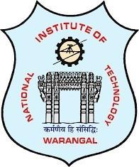
</p>

# AI-Based Autonomous Vehicle for Smart Campus Navigation

An end-to-end autonomous driving prototype built during a Summer Internship at the **Centre for Innovation and Incubation, NIT Warangal**. The vehicle learns to steer itself using a **PilotNet-style convolutional neural network**, trained on camera images and human-driving data, and deployed for real-time inference on an embedded control pipeline.

> Internship Duration: May 05 – July 05, 2026
> Institution: National Institute of Technology, Warangal
> Supervisor: Prof. L. Anjaneyulu, Dept. of ECE, Head — Centre for Innovation and Incubation

<p align="center">
  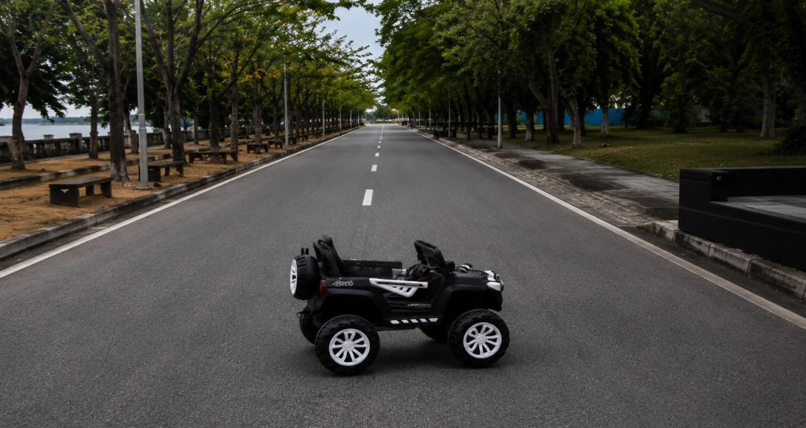
  <br>
  <em>Final prototype — a modified Toyzone Buster electric ride-on vehicle, tested on a tree-lined campus roadway</em>
</p>

---

## Overview

This project implements an **end-to-end deep learning approach to autonomous steering**, inspired directly by NVIDIA's research on self-driving systems. Rather than hand-coding lane-following rules, the vehicle learns to map raw camera images directly to steering commands — the same philosophy behind NVIDIA's landmark *"End to End Learning for Self-Driving Cars"* paper.

The system was developed in two phases:

1. **Small-scale prototype** — a single-camera Toyzone car chassis used to validate the full control pipeline (image capture → dataset logging → model training → inference → motor actuation).
2. **Full-scale vehicle** — a modified Toyzone Buster electric ride-on vehicle fitted with three front-mounted cameras, embedded compute, and a transistor-based interface that electronically drives the vehicle's stock RF remote — enabling autonomous control without modifying the vehicle's original electronics.

<p align="center">
  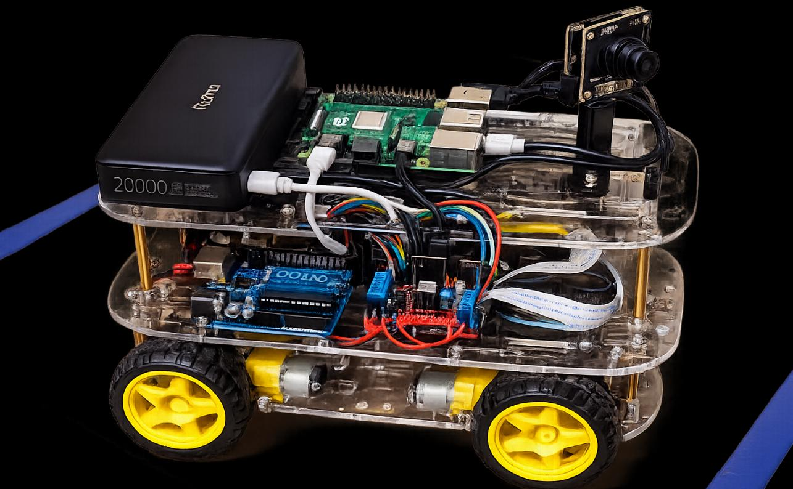
  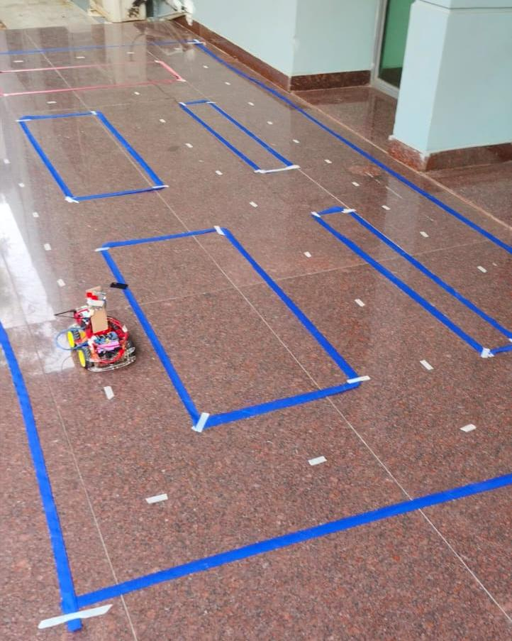
</p>
<p align="center"><em>Left: small-scale chassis prototype (Raspberry Pi + Arduino + camera). Right: indoor test track used to validate data collection and control.</em></p>

---

## Core Model: PilotNet

The heart of this project is **PilotNet**, NVIDIA's end-to-end convolutional neural network architecture for predicting steering angle directly from a single front-facing camera image.

<p align="center">
  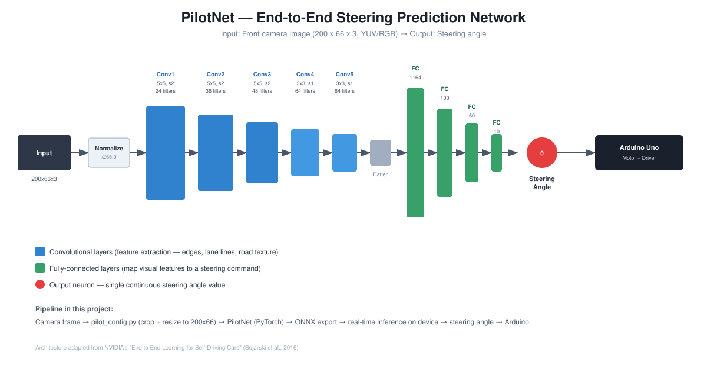
</p>

### Why PilotNet
- **End-to-end learning** — no manually programmed lane-detection or path-planning rules. The network learns steering behavior purely from human driving demonstrations.
- **Direct image-to-steering mapping** — a road image goes in, a steering angle comes out.
- **Automatic feature extraction** — convolutional layers learn to detect lane markings, road edges, and relevant visual features on their own.
- **Proven architecture** — adapted from NVIDIA's autonomous driving research, well-suited to low-cost embedded hardware.

### How it works in this project
1. **Capture** — front-facing camera(s) record the road while a human manually drives the vehicle via joystick.
2. **Preprocess** — each frame is cropped (to remove sky, walls, and vehicle body) and resized to `200 × 66` using a single shared preprocessing function, ensuring training and inference always see identical input.
3. **Train** — a PyTorch implementation of PilotNet is trained on the (image, steering angle) dataset using Smooth L1 / MSE loss.
4. **Export** — the trained model is exported to **ONNX** for lightweight, portable inference.
5. **Drive** — during autonomous operation, the model predicts a steering angle for each live frame, which is sent to the motor controller in real time.

### Multi-Camera Configuration
Following NVIDIA's PilotNet methodology, the full-scale vehicle uses **three front-mounted cameras** (left, center, right) instead of one:

| Camera | Approx. FOV | Role |
|--------|------------|------|
| Left   | ~70°  | Detects deviation toward the left edge |
| Center | ~90°  | Primary forward view for lane and obstacle detection |
| Right  | ~70°  | Detects deviation toward the right edge |

Combined, the three cameras provide ~180° of horizontal coverage. This multi-view setup significantly enriches the training dataset and improves the model's ability to **recover from small deviations** from the lane center — a key trick from the original NVIDIA PilotNet paper.

<p align="center">
  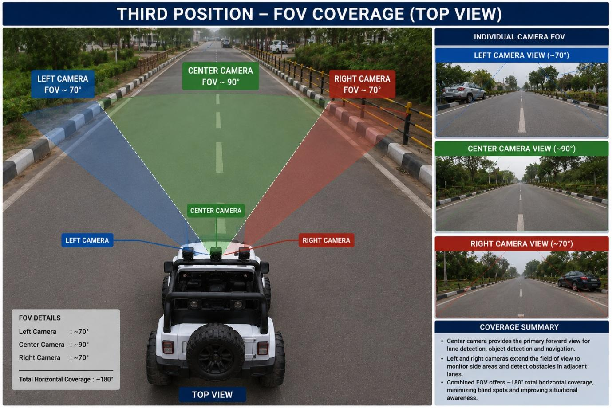
  <br>
  <em>Left / center / right camera field-of-view coverage used for multi-view PilotNet training</em>
</p>

---

## System Architecture

### Hardware
| Component | Role |
|---|---|
| Raspberry Pi 4 Model B / Laptop | Main compute — AI inference, image processing |
| Arduino Uno | Low-level motor control, sensor interfacing |
| 3× USB Cameras | Front-facing vision system (left / center / right) |
| Ultrasonic Sensors | Obstacle detection |
| L293D Motor Driver | Speed and direction control for DC motors |
| 2N2222 Transistors | Electronically simulate RF remote button presses |
| 12V 8Ah Battery / 20000mAh Power Bank | Onboard power |
| Toyzone Buster Electric Ride-On Vehicle | Base platform for the full-scale prototype |

<p align="center">
  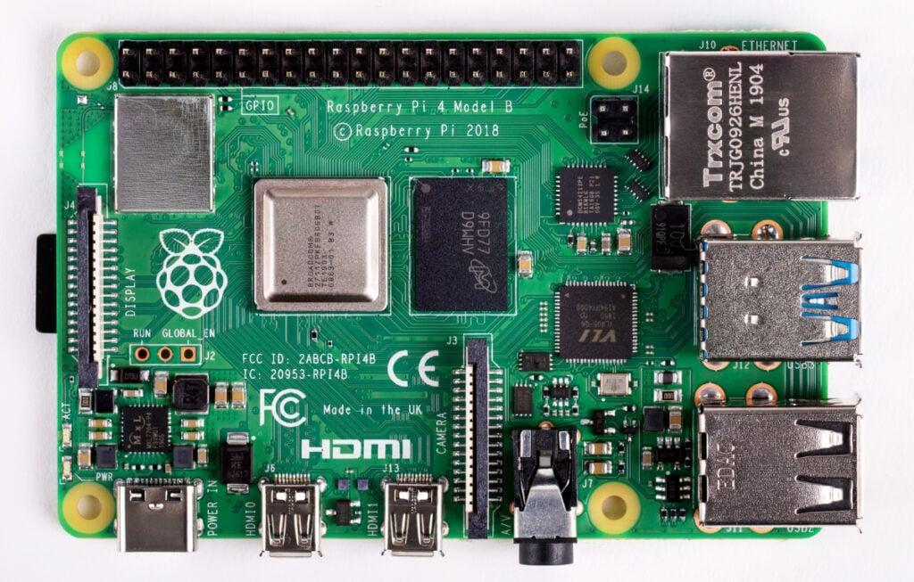
  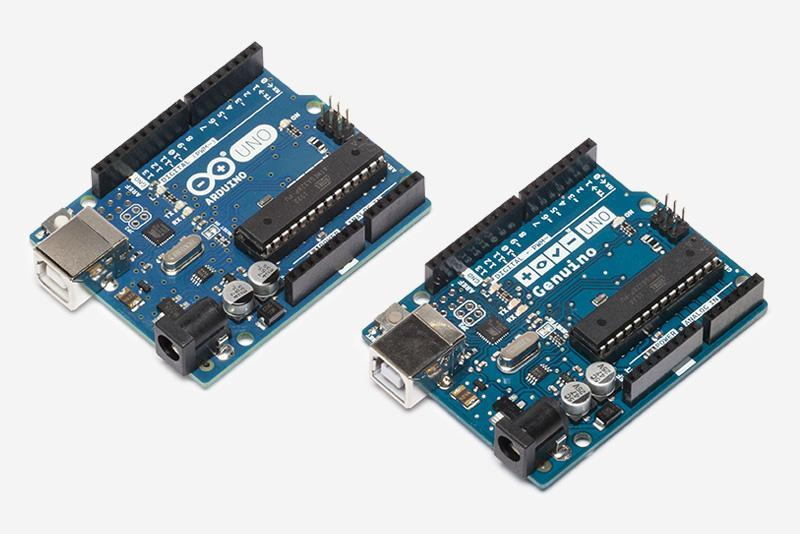
  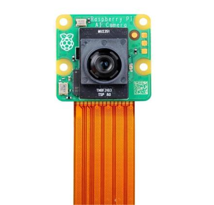
  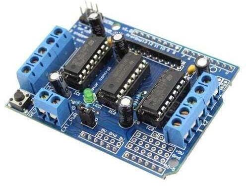
</p>
<p align="center">
  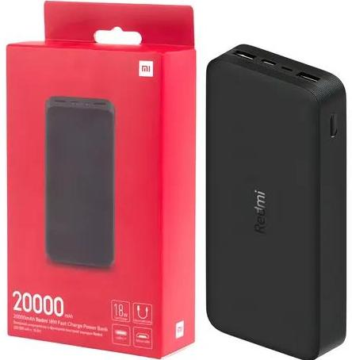
  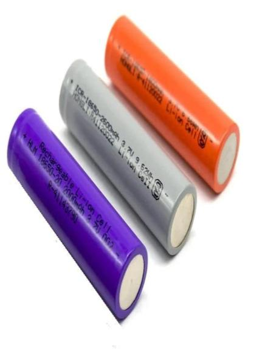
  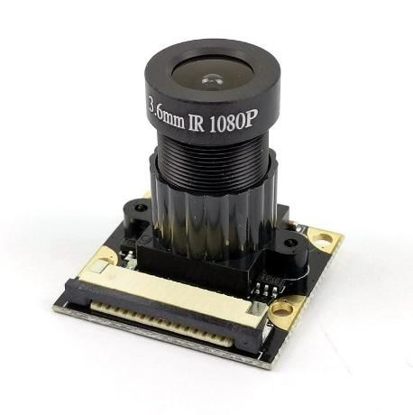
</p>
<p align="center"><em>Core hardware — Raspberry Pi 4, Arduino Uno, camera modules, L293D motor driver, and power supply</em></p>

### Software Stack
- **Python** — primary language for AI, computer vision, and control logic
- **PyTorch** — PilotNet model definition and training
- **ONNX** — model export for deployment
- **OpenCV** — image processing
- **YOLO (You Only Look Once)** — object, pedestrian, and number-plate detection
- **Flask** — lightweight HTTP interface for data collection and control
- **Arduino (C/C++)** — motor and sensor firmware

### Control Flow
```
Camera(s) → Image Preprocessing (pilot_config.py) → PilotNet Inference (ONNX)
          → Predicted Steering Angle → Arduino Uno → Motor Driver → Vehicle Movement
```

The full-scale vehicle preserves the original Toyzone Buster electronics entirely. Instead of rewiring the vehicle, transistors are wired across the RF remote's button contacts; the control software fires the appropriate transistor to simulate a button press, which the vehicle receives wirelessly exactly as if a human pressed the remote.

---

## Repository Structure

```
├── pilot_config.py       # Single source of truth for image crop/resize (train + inference)
├── pilot_collector.py    # Captures camera frames + steering/speed data → training dataset
├── pilot_model.py        # PilotNet CNN architecture (PyTorch)
├── pilot_train.py        # Trains PilotNet on collected dataset, exports model.onnx
├── arduino/              # Arduino motor control firmware
└── dataset/              # Collected driving sessions (images + log.csv)
```

| File | Purpose |
|---|---|
| `pilot_config.py` | Defines crop parameters and `crop_and_resize()`, shared by every other module so training and driving views never drift apart |
| `pilot_collector.py` | Flask server that logs camera frames alongside steering angle and speed while a human drives |
| `pilot_model.py` | PilotNet convolutional neural network definition |
| `pilot_train.py` | Loads the dataset, trains PilotNet, saves `model.pt` and `model.onnx` |

---

## Methodology

1. **Data Collection** — Drive the vehicle manually; `pilot_collector.py` logs synchronized camera frames and steering/speed values.
2. **Preprocessing** — `pilot_config.py` crops out irrelevant regions (sky, chassis) and resizes frames to `200×66`.
3. **Model Development** — `pilot_model.py` defines the PilotNet CNN.
4. **Training** — `pilot_train.py` trains the network end-to-end and exports it to ONNX.
5. **Deployment** — The ONNX model, along with `crop.json`, is copied to the onboard compute unit.
6. **Autonomous Driving** — The vehicle captures live frames, runs PilotNet inference, and streams predicted steering commands to the Arduino in real time.

---

## Results

<p align="center">
  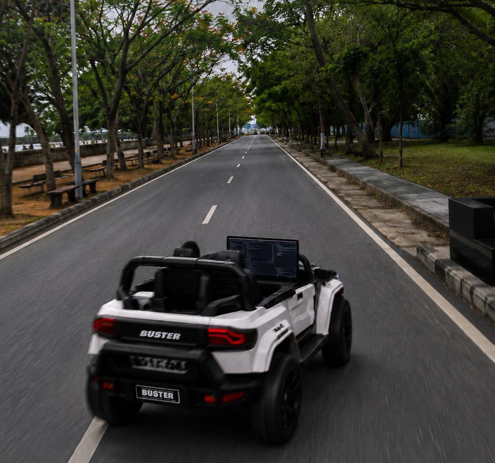
  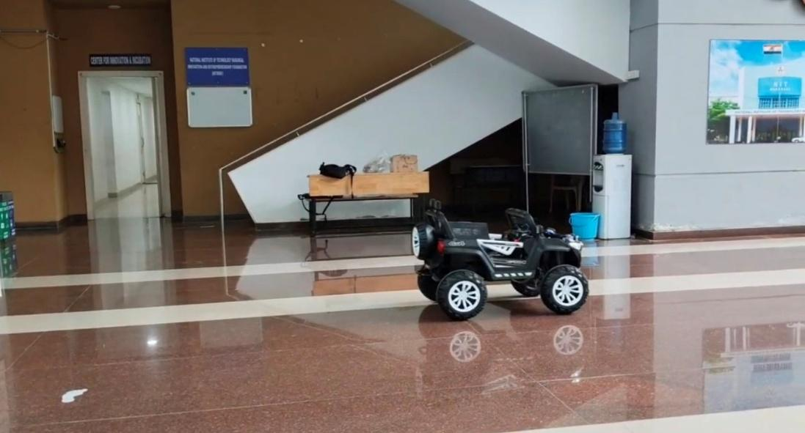
</p>
<p align="center"><em>Left: autonomous test run on the tree-lined campus roadway. Right: final prototype vehicle.</em></p>

- The vehicle successfully navigated its predefined training route **without manual joystick intervention**, validating the end-to-end deep learning approach.
- The three-camera PilotNet configuration produced measurably better steering stability and recovery behavior than the single-camera prototype.
- Minor steering variation was observed under changing lighting conditions and faded lane markings; overall system performance was reliable within the tested environment.

**Key takeaway:** the model performs reliably on its trained route, but generalization to unseen environments and routes remains an open area for further work.

---

## Future Scope

- Deploy PilotNet on an embedded AI accelerator (e.g., [NVIDIA Jetson Orin Nano](https://developer.nvidia.com/embedded/jetson-orin)) for a fully onboard autonomous system
- Expand the dataset across multiple routes, lighting conditions, and weather scenarios to improve generalization
- Integrate real-time YOLO-based obstacle detection alongside PilotNet steering
- Add GPS/waypoint-based navigation for multi-destination autonomy
- Apply data augmentation (brightness shift, shadow simulation, flips with angle correction) to improve robustness
- Quantitative evaluation via steering error, trajectory deviation, and path-following accuracy metrics

---

## References

**Research Papers**
- Redmon, J. et al. — *You Only Look Once: Unified, Real-Time Object Detection*
- NVIDIA — *End to End Learning for Self-Driving Cars* (PilotNet)

**Books**
- Maurer, M., Gerdes, J.C. — *Autonomous Driving*
- *Computer Vision: Algorithms and Applications*

**Documentation**
- Raspberry Pi Documentation
- Arduino Documentation
- PyTorch / TensorFlow Documentation

---

## Team

- Raparthi Arun
- Kota Anuj Kumar
- Thangellapelly Karthik
- Domakuntla Lahari

**Institution:** Vaagdevi College of Engineering, Bollikunta, Warangal
**Internship hosted at:** Centre for Innovation and Incubation, NIT Warangal
**Supervisor:** Prof. L. Anjaneyulu

---

## License

This project was developed as part of an academic summer internship. Please contact the authors before reuse in commercial or derivative work.
